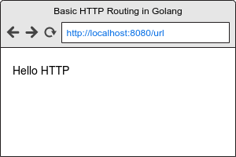

# Basic HTTP Routing in Golang

Golang is incredibly powerful.  Its standard library has so much to offer, but I think other languages have encouraged the use of external libraries for even the most basic tasks.  For example, with JavaScript, most inexperienced developers seem to use jQuery to do simple tasks like selecting an element and replacing its contents. When you and I both know jQuery is way overkill for such a task.  [See my article on Vanilla JS basics.](/coming-soon).

I believe that in order to be considered an expert in a language, you must at least be able to demonstrate using the core language to achieve your goal.  In our current case, HTTP routing.  Now to be clear, I don't think you need to write everything from scratch all the time, but you should have a firm grasp on what is available by the core language, and when you are better suited to use an external library.  If you are looking for more advanced HTTP routing, then I would suggest using something like [gin](https://github.com/gin-gonic/gin).

Enough ranting, let's get to it.

## Assumptions

I assume you have basic knowledge of the Go language at this point, so if not, it might be worth searching for some entry level basics first.  See [A Tour of Go](https://tour.golang.org).

## Let's begin

### Step 1

Here is our basic folder structure for this basic http routing example:

        basic-http-routing-in-golang/
            main.go

As a starting point our `main.go` file looks like this:

        package main

        import (
            "fmt"
            _ "net/http"
        )

        func main() {
            fmt.Println("Hello HTTP")
        }

### Step 2

Now starting at a very basic level, we can leverage the [`http.HandleFunc`](https://golang.org/pkg/net/http/#HandleFunc) method.

It is very simple to use and its signature is easy to understand.

        func HandleFunc(pattern string, handler func(ResponseWriter, *Request))

Which basically means, `http.HandleFunc("/url", routingFunction)` where `routingFunction` looks like this:

        func routingFunction(w http.ResponseWriter, req *http.Request) {
            fmt.Fprint(w, "Hello HTTP")
        }

With `fmt.Fprint()` we can pass an `http.ResponseWriter` and a message to display.  Our browser will now look like this when we visit the `/url` endpoint.

Here is what `main.go` looks like at this point:

        package main

        import (
            "fmt"
            "log"
            "net/http"
        )

        func main() {
            http.HandleFunc("/hello", HelloHTTP)
            log.Fatal(http.ListenAndServe(":8080", nil))
        }

        func HelloHTTP(w http.ResponseWriter, req *http.Request) {
            fmt.Fprint(w, "Hello HTTP")
        }

