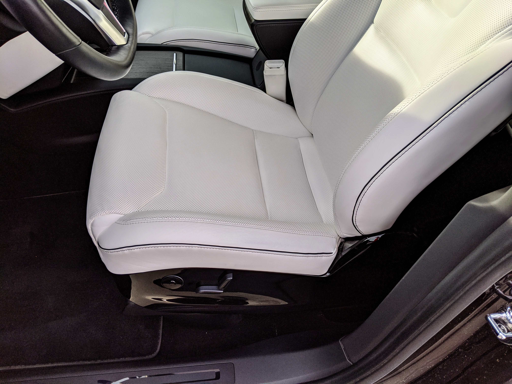
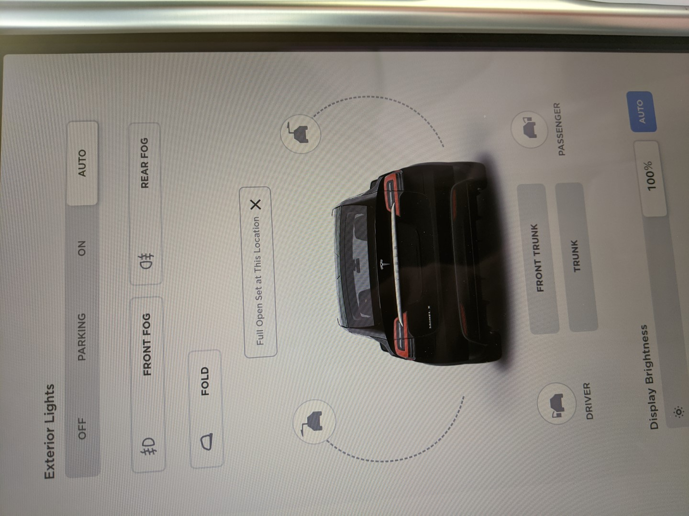

# 2016 Tesla Model X P90DL #

Meet Bolt - Our Black 6 seater Model X w/Ludicrous upgrade!

In preparation for the eventual Cybertruck release, we are selling our very well taken care of Model X.

This vehicle has all the upgrades available, and includes:

* Upgraded Premium Sound package
* Cold Weather package
* All 6 seats heated
* Front driver and passenger heated AND Cooled/Ventilated seats
* LUDICROUS upgrade (0-60 in 3.0 seconds)
* 90 kWh battery pack
* Auto-presenting front driver door (as you walk up with the key, the door opens automatically)
* Advanced keyfob allows for opening all doors individually or closing them all with the touch of a button
* Falcon-wing doors
* Loads of storage space
* Rear fold flat seats
* Additional storage locker behind rear seats
* Front-trunk (frunk)
* Automatic air suspension `Very High`, `High`, `Standard`, `Low`, and `Very Low` settings
* When set to `Very High` or `High` a GPS position is used to automatically raise the next time you visit the same location
* Summon (pull into or out of a parking space w/o being in the vehicle)
* Autopilot (steering within well marked roads) AP1
   * Many people believe this is a superior Autopilot driving experience to the newer camera-only systems provided in late-model Tesla vehicles
* Adaptive Cruise (keeps speed to vehicle ahead)

Additionally
* New all-weather tires this year 2020 (Nokian WR G4 SUV performance all-weather tire) See [nokiantires.com](https://www.nokiantires.com/all-weather-tires/nokian-wr-g4-suv/)
  > The versatile Nokian WR G4 SUV optimally combines high-performance, all-season handling and reliable winter grip to make it a true all-weather tire [...] with new innovations to ensure performance in snow storms, heavy rain or sun-scorched asphalt, so you can forget the forecast regardless of the season.
* Custom fitted floor mats by [TOUGHPRO](https://toughpro.com/) (Made in USA, Lifetime Warranty)
* Premis Window Mesh [Sun Shades](https://www.amazon.com/dp/B07FG26ZCR/ref=cm_sw_r_tw_dp_x_gmjlFbC47W40E)
* New half-shafts in front drivetrain to fix the known issue that plagues many Model X owners (covered under warranty)

This vehicle is LOADED.

All doors can be operated from the Center Screen

# REMOVE
Replace 
../public

//wsl$/Ubuntu-20.04/home/leothelocust/Projects/personal/website/public
